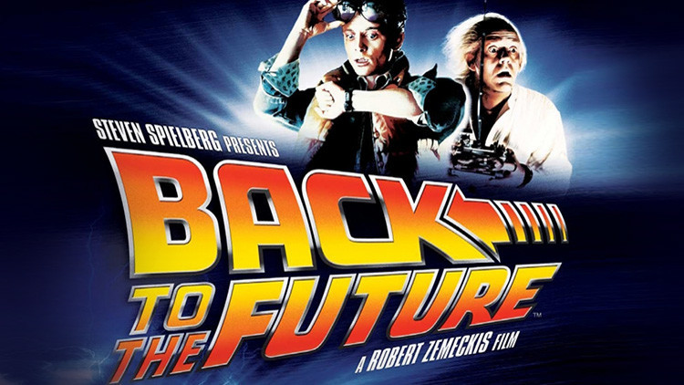

# Volver al Futuro
 

## Ejercicio integrador

**En esta ocasión el Dr. Emmett Brown nos contrató para realizar un sistema que lo ayude a mantener un registro de sus viajes en el tiempo. Como el doctor es conocido de algunos docentes argentinos, pide que el sistema sea hecho en objetos.**

Tenemos varios personajes que viajan en el tiempo. El objetivo principal es ver qué les va pasando a medida que avanza (?) el tiempo

### Personajes

De cada personaje conocemos características personales y elementos que llevan consigo. Puede haber muchos elementos diferentes y de todos conocemos una descripción y su fecha, pero en especial es importante la documentación donde pueden aparecer los personajes de las película, como ser fotos o periódicos. También se destacan algunos elementos que fuera de época pueden provocar situaciones extrañas, como por ejemplo un libro de resultados deportivos, de los cuales se registra quién es el dueño original.

Algunos de los personajes, por ejemplo, son:

- Dr Emmett Brown (conocido como "Doc"): Tiene 71 años y mide 1,80. Lleva lentes de 1985, un control remoto fabricado en 1985, un perro llamado einstein de 1980, una foto de 1885 donde está él con un reloj, y un recorte de una revista universitaria de diciembre de 2016 donde no aparece ningún personaje de la película. 
- Marty Mcfly: Tiene 25 años y mide 1,70. Lleva una patineta voladora del 2015 de la que es el dueño y una foto de 1985 donde está él y sus hermanos.
- Jennifer Parker: Tiene 26 años y mide 1,50. En este momento no lleva nada.

Se pide Modelar los personajes y permitir averiguar: 

1. Si son mayores (Más de 50 años) . Método esMayor( )
2. Si tiene algún elemento propio, por ejemplo una foto o cualquier otro documento en el que aparece, o un elemento del que es dueño. Método tieneElementoPropio( )

### Viajes
Para viajar, los personajes deben estar subidos al DeLorean, activar el condensador de flujo, indicar la fecha de destino en el panel digital, y acelerar hasta llegar a la velocidad de 88 mph.
Los viajes se realizan en el vehículo favorito de todos, el DeLorean, que usa barras de plutonio como combustible, pero en ocasiones se puede reemplazar por otro y suceden cosas diferentes.

- Al utilizar plutonio o cualquier elemento radiactivo, es casi imposible evitar los efectos secundarios y la altura de todos los viajeros se reduce en 1 cm.  
- Cuando usan nafta, el combustible habitual del DeLorean, los personajes mayores rejuvenecen 10 años de edad, mientras que los menores envejecen 5. 
- Si se utiliza energía eléctrica, por ejemplo de un rayo que cae sobre el reloj del pueblo, a todos los viajeros se les pierde la cosa más antigua que llevaban consigo. (en caso que no llevaran nada, se produce un error).
- También, otra posibilidad es utilizar basura, lo cual genera fuertes olores hacen al viaje en el tiempo una tarea difícil de sobrellevar que de alguna manera afecta a los viajeros (inventar una forma sencilla pero no trivial en que sean afectado los viajeros).

Se pide:

1. Implementar el método viajarA(unDestino,unaFecha) que representa un viaje en el tiempo en el DeLorean al destino indicado, en el que sucede lo que corresponda.  No es necesario llevar un registro de viajes realizados.
2. Mediante otro métodos, permitir cambiar el combustible, subir y bajar personajes del vehículo.
3. Hacer tests de al menos dos viajes 

### Situaciones especiales 
#### Los antepasados

Uno de los viajes, en el que van Doc y Marty en el DeLorean, tiene por destino el lejano oeste en el siglo XIX. Allí se encuentran con muchos personajes, entre quienes hay familiares de Marty.

1. Se quiere averiguar quienes son todos los personajes del destino, que tengan el mismo apellido que un personaje indicado y que sean mayores. Implementar el método antepasadosDe(unPersonaje).

#### Fotos que se desvanecen

Cuando alguno de los viajeros viaja al pasado e interviene en la realidad del momento, puede generar cambios con consecuencias impensadas. Cuando eso sucede, las fotos y otros documentos del futuro se desvanecen o modifican. Por ejemplo, en una oportunidad, Marty altera la historia de sus padres y hace que tanto él como sus hermanos desaparezcan de la foto que llevaba. 

1. Para los ocupantes actuales del DeLorean, dado un personaje y una fecha, hacer que dicho personaje desaparezca de todas las fotos u otros documentos futuras que tengan los viajeros y que todo elemento que sea del futuro agregue a su descripción el prefijo "BTTF". Implementar el método huboUnProblemaCon(unPersonaje,unaFecha)

### Paradojas temporales

Una de las paradojas que puede suceder es que el viajero se encuentre consigo mismo en un futuro o pasado.  Por ejemplo, Jennifer se encuentra consigo misma en uno de los viajes. En la película, son la misma persona, pero en dos momentos diferentes de su vida, con distinta edad o altura. ¿Cómo se podría modelar en el paradigma de objetos? No implementarlo, simplemente explicarlo desde los conceptos.
